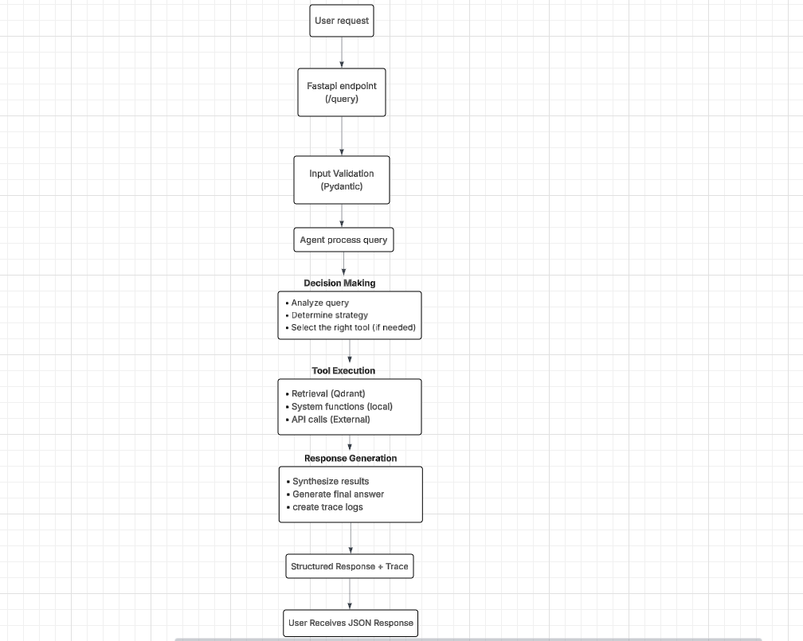

#  Chat Agent API (FastAPI + ChatOllama + Qdrant)

This project implements a modular AI Agent API built on **FastAPI**, integrating **ChatOllama (Llama 3.2)** as the LLM backend, **Qdrant** as the vector store, and **LangChain** utilities for document ingestion and retrieval.  
It allows querying documents and interacting with an intelligent agent capable of deciding between **direct responses** or **retrieval-based answers**.

---

##  Features

- 🔹 **Chat Agent** powered by Llama 3.1 via ChatOllama backend  
- 🔹 **Vector Search** using Qdrant  
- 🔹 **Embeddings** generated via `SentenceTransformerEmbeddings` (LangChain)  
- 🔹 **Retrieval Augmented Generation (RAG)** workflow  
- 🔹 **Tool Registry** endpoint for querying available tools  
- 🔹 **Trace-based Observability** for every request

---

## Project Setup Guide

### 1. Clone the repository
```bash
git clone https://github.com/judeleonard/minimal-rag-agent.git
cd minimal-rag-agent
```

### 2. Create and activate a virtual environment
```bash
python3 -m venv venv
source venv/bin/activate
```

### 3. Install dependencies

```bash
pip install -r requirements.txt
```
### 4. Configure Environment Variables

```python
HF_API_URL=https://api-inference.huggingface.co/models/mistralai/Mistral-7B-Instruct-v0.3 # or any HF of choice
HF_API_TOKEN=hf_your_token
CONTAINER_NAME=minimal-rag_app
```

### 5.Install Ollama CLI**: Ollama is required for managing and running local LLM models.

```bash
curl -fsSL https://ollama.com/install.sh | sh
```
- **Pull the Latest LLM Image**: After installing ollama, pull the latest image assuming you have docker already installed. This project is built with `llama3.2`

```bash
ollama pull llama3.2

# verify llama3.2 has been successfully pulled
ollama list

```

### 6. Vector Database Setup

```bash
cd Qdrant

docker-compose up -d
```
- Acess Qdrant dashboard at http://localhost:6333/dashboard
- Load document incrementally from data directory which accepts document in any formats by running the below command 

```bash
python3 ingestion/ingestion.py
```

### Deployment (Docker)

```bash
docker-compose up -d --build
```

### Arhictecture overview




## Core Components

| Component | Technology | Purpose |
|------------|-------------|----------|
| **Agent Layer** | FastAPI + ChatOllama | Handles user requests, decides between `SEARCH` or `RESPOND`, synthesizes answers |
| **Vector Store** | Qdrant | Stores and retrieves document embeddings for contextual search |
| **Embeddings** | SentenceTransformer (LangChain) | Converts text into dense vector representations |
| **Tracing** | Custom tracer module | Logs every decision, tool call, and model response for auditability |

---

## Design Decisions

1. **LLM Backend – ChatOllama (Llama 3.2)**
   - Chosen for local, GPU-based inferencing with minimal latency.
   - No external API dependency.
   - Configurable via `settings.MODEL_BACKEND = "chatollama"`.

2. **Vector Database – Qdrant**
   - Lightweight, high-performance local vector search engine.
   - Chosen over Pinecone/Weaviate for offline deployment and easy Docker setup.

3. **Embedding Generation**
   - Uses `SentenceTransformer` from HuggingFace.
   - Provides high-quality sentence-level representations.
   - Combined with document text chunking for chunking large documents.

4. **Configurable Backends**
   - Optional support for Hugging Face Inference API (fallback backend).
   - Future-ready for adding additional LLM providers.

5. **Observability**
   - Every step (decision, retrieval, synthesis) is recorded via `Trace` objects.
   - Enables transparent debugging and monitoring of agent reasoning.

---